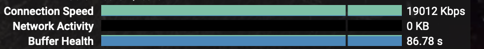

# 一个youtube app使用quic引起的问题

---

# 一个youtube app使用quic引起的问题

## 问题描述

家里是`r2s`做旁路由,使用的是`sing-box`的`tun`模式, 之前一直用的是`cn2 gia`的线路,每天晚上用`apple tv`上的`youtube` 看看视频睡觉,没有什么问题, 这个月服务器流量用光了, 就在普通线路上用`hysteria2`, 半天用的都没有什么问题,结果到了晚上, `youtube`根本不能看,想到可能是晚上`udp`丢包比较严重,于是就没有管.

有一天实在受不了了, 晚上用笔记本开浏览器上`speed.cloudflare.com`测试了一下速度,确实正常的,有`40M`以上的下行速度,我寻思着这个看YouTube没有问题啊,于是用笔记本浏览器打开`youtube`, 发现速度正常, 2W+`Kbps`,`4k`都没问题. 我赶紧又去`apple tv`上测试,发现还是卡,速度只有2,3百`Kbps`. 百思不得其解.

## 解决过程

于是我用各种不通的设备测试, 发现,出来`apple tv` 和 `chromecast tv`上的`youtube app`, 其他,手机`app`, 浏览器,全部都正常.
这明显有问题, 我又想这个问题是最近出现的,就去`google`了一下,看看有没有能有同样的问题,我分别按`apple tv`和`chromecast tv`上的`youtube app`的版本号去搜索,都没有发现有相关资料. 
  
于是去`sing-box`的`dashboard`上看了下, 用正常速度播放的时候, 看连接就是正常的, 用电视上的`youtube tv`播放, 连接速度就起不来,始终只有不到`100KBps`. 
真是郁闷至极, 我测试了把协议换成`vmess`, 居然都比现在快, 但是浏览器和`app`速度都不怎么样了.

就在我又准备放弃的时候, 我发现`dashboard`上,`apple tv`的关闭连接数量在不停的增长, 再看`pc`对应`ip`的,却是正常的, 这明显有问题, `apple tv`怎么会发起那么多的连接, 我再仔细一看, 发现`apple tv`连`YouTube`的连接, 协议是`tun(udp)`, 明明是视频,走`443`端口,怎么是`tcp`, 我突然想到了`quic`, 会不会是因为走的`quic`, 而`quic`又是基于`udp`的,是一个一个包,而`tun`这边收到包后,转给`hysteria`的端口跳跃,每一个(或多个)包都会换端口,而且会建立新的连接,这样"关闭"的连接如此多就说的通了. 

于是我去`google`了一下, 找到一个 [issue](https://github.com/SagerNet/sing-box/issues/664), 使用一下`rule`:

```json
{
"protocol": [
"quic"
],
"outbound": "block"
},
```

更新了一下配置, 结果..., 没用. 唉, 搞到快凌晨一点了,算了明天再搞, 由于下午喝了咖啡,再加上心理惦记这个事情,一晚上没有睡好, 周末起个大早, 再试试.

## 解决

想了一晚上, 我觉得我的思路是对的, 肯定是走的`quic`, 把这个禁用了, `youtube app`就会换成`tcp`了. 
看了下`dashboard`, 发现`tun(udp)`这条对应的`rule`并不是我设置的`block`, 就是没有生效.

于是又继续看`sing-box`的文档, 换了一段`rule`配置:

```json
{
  "type": "logical",
  "mode": "and",
  "rules": [
    {
      "network": ["udp"]
    },
    {
      "port": [443]
    }
  ],
  "outbound": "block"
}
```

这段很明确了, `udp`并且是`443`端口, 就`block`, 这个可能会有误杀, 但是应该不会放过`youtube`的`quic`了. 

更新配置, 应用陪着, 测试:

终于正常了. 这不是我用浏览器测试了一下,还一直蒙在鼓里, 现在,终于可以放心看视频睡觉了...
