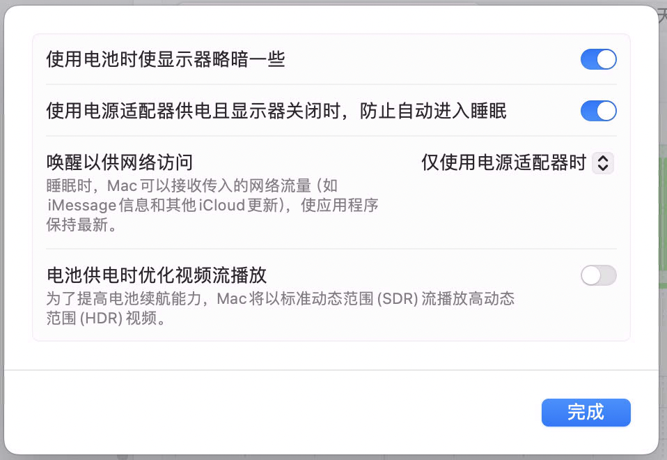
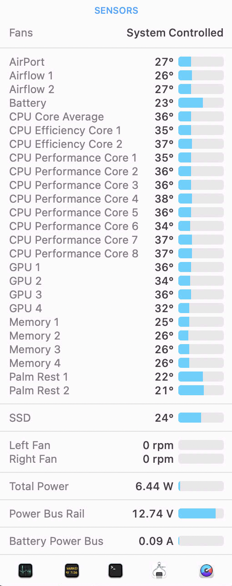

# 将家庭服务器从DELL R720迁移到蜗牛星际+MacbookPro 后续


# 将家庭服务器从DELL R720迁移到蜗牛星际+MacbookPro 后续

## 千兆网络断流问题

迁移已经完成了,试用了一段时间, `星际蜗牛`功耗很低(相对`R720` 100多瓦), 3块`HDD`, 1块`SSD` 功耗35瓦, 一天不到1度电,非常不错.

但是目前有个问题,就是`MacbookPro`, 只要一盒盖,或者锁定屏幕, 或者远程桌面关闭后, `雷电HUB`上的有线网卡就断开了. 

这个时候非要重新登入,如果是远程的话,用`MacbookPro` 的无线网卡的`IP`连接,才可以再次使用有线网卡的`IP`.

一开始以为是`HP G2`雷电`hub`的问题, 换了别的`USB HUB`使用千兆网口也是一样. 

继续测试,我用旧的`Intel` 架构的老`Macbook` 测试, 结果也是一样. 

## 解决

于是开始漫长的`google`, 发现很多人有这个问题,但是,没什么解决办法, 都是说在`设置-节能`中修改, 我也改了:

主要就是: 
- 使用电源适配器时,防治自动进入休眠
- 唤醒以供网络访问

这两个选项的各种排列组合我都试过了, 不行. 

然后又有说去`pmset -g`看`hibernatemode`, `pmset`是`Mac`系统查看电源管理的`cli`工具. 
我看了下我的, 是`3`, 觉得跟这个没有关系, 但是这个时候我看到`pmset -g`结果中有一个 `SleepDisabled 0`, 这个参数我去查了一下: 表示禁用休眠,难道是这个?抱着试一试的心态我执行了:
`sudo pmset -a disablesleep 1`
执行完成后, `pmset -g`输出结果:

```
System-wide power settings:
 SleepDisabled          1
Currently in use:
 standby              1
 Sleep On Power Button 1
 hibernatefile        /var/vm/sleepimage
 powernap             1
 networkoversleep     0
 disksleep            10
 sleep                0 (sleep prevented by screensharingd, powerd)
 hibernatemode        3
 ttyskeepawake        1
 displaysleep         1
 tcpkeepalive         1
 powermode            0
 womp                 1
 ```

其中`SleepDisabled          1`表示设置成功了,测试一下, 果然. 不管多长时间, 有线网卡都是可以使用的了. 

这样看来,`Mac`没有类似`Windows` 那样的设置开关, 让系统在接电源时一直不休眠. 

`M1`架构一直开机待机,功耗也就不到10瓦


现在可以安心使用`emby`随时看片了...
