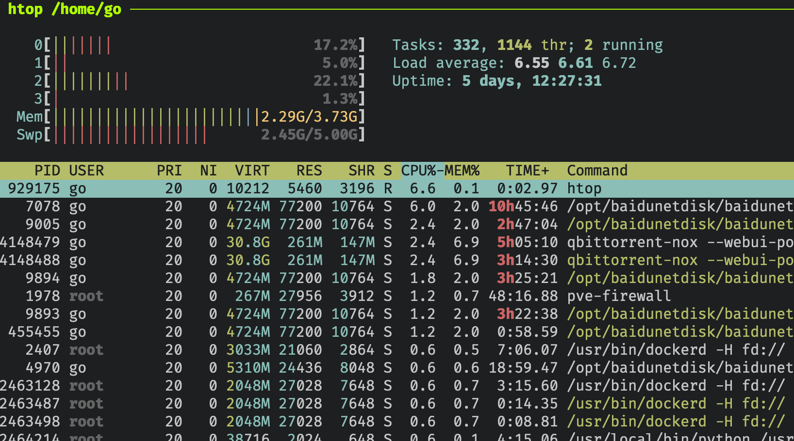
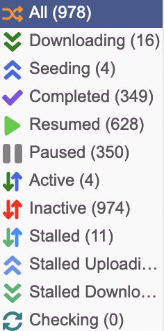
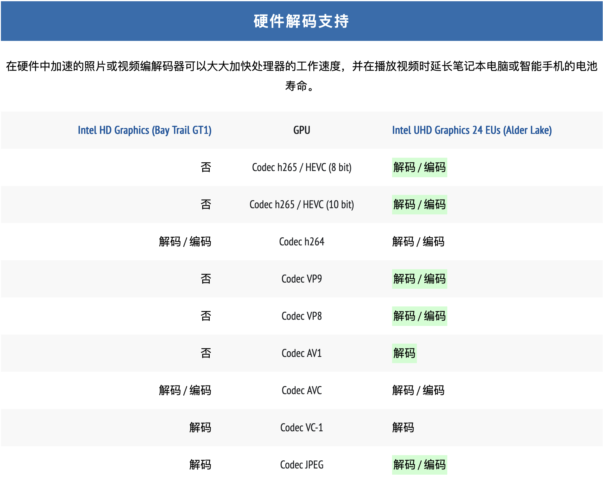
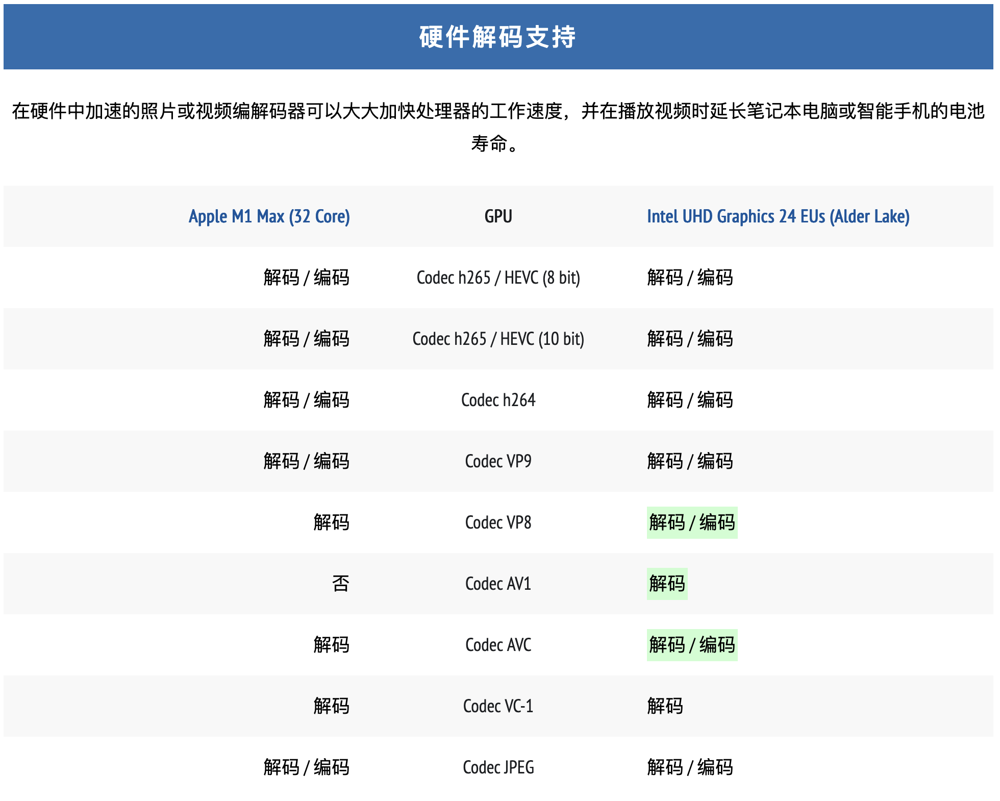

# 将家庭服务器从DELL R720迁移到蜗牛星际+MacbookPro


# 将家庭服务器从DELL R720迁移到蜗牛星际+MacbookPro

前几年网`HomeLab`, 买了一台二手`Dell R720`机架服务器, 用来做家庭服务器. 但是由于这台服务器的功耗太高, 双`cpu`待机就要快200w, 换了低功耗的`志强`后,只安装一个`cpu`,也有100w+, 一年下来电费不少,而且,到了夏天,非常的热,后来使用`ipmi`工具,用`python`写了个代码,根据温度来调节暴力风扇,要舒服许多,但是,夏天,室温升高,风扇还是会平方提高转速. 一直想换成低功耗的服务器. 之前买了`蜗牛星际`, 这个使用的是`j1900`, 功耗很低的, 于是就把家庭服务器从`Dell R720`迁移到了`蜗牛星际`.

## 尝试

`Dell R720`买回家后,前前后后装了太多`vm`, `lxc`, 折腾`k8s`, `rancher`等,内存加到了`64G`, 还可以往上加,毕竟`ddr3 ecc`的服务器内存太便宜了,不过`64g`足够了,根本用不完,搞多了费电.

目前保留了两个`lxc`, 一个跑`bt`,`qt`, 我都用的是`qbittorrent`, 把`bt`和`pt`服务分开了.
目前已经用`qbittorrent`下载了快`40t`的数据:


`qbittorrent`非常稳定,之前用`transmission`,感觉不好用,速度也一般. 这个`lxc`是必须要迁移的.

另一个`lxc`也是是跑`ubuntu`, 用来存储整套媒体工作流:

- `jellyseerr` 用来检索影片
- `prowlarr` 用来检索`index`,提交下载任务
- `sonarr` 用来提交`电视剧`任务
- `radarr` 用来提价`电影`任务
- `jellyfin` 用来播放影片

这套工作流非常稳定了, 需要迁移. 因为这些用不了太多资源, 放`R720`上太浪费资源. 

## 步骤

- `星际蜗牛`上安装`pve`, 这个是必须的. 
- `星际蜗牛`上配置两个`ubuntu`的`lxc`, 这个是必须的.
- 将原来各个`docker`使用的`docker-compose`文件和挂载用的`config`文件夹,用`rsync`全部同步过来
- 在`蜗牛`上使用`mount -t nfs`挂载影视资源和下载目录. 
- 将`docker-compose`映射的目录改成`mount`后的目录
- `docker-compose up -d` 启动所有服务

就这样完成了,为什么需要挂载`nfs`,而不直接将硬盘移动过来,因为我不知道`蜗牛`的`j1900`+`4G` 内存是否能搞定这多的服务. 先测试过可以,最后再迁移硬盘.

## 发现的问题

### 内存不够

`星际蜗牛`开机没多久,就会出现`cpu`占用100%, 但是`top`查看, 是一个叫`kswapd`名称的进程, `google`了一下, 是`交换空间`管理进程, 说明`4g`内存不够了. 

默认`swap`只有`512M`, 于是准备用`swapon`等命令创建几个G的`swap`分区, 结果发现`root`分区不够了,因为我一开始就是测试下, 所以在`蜗牛`上内置的`sata`接了一个`120G`的`ssd`, 用来做`root`分区, 但是`120G`的`ssd`太小了, 光是`lxc`的硬盘就占了`80G`, 现在没有去买大的`sata`接口的`ssd`了,就先将就,后面直接用大的`ssd`, 用`clonezilla`替换. 

先把`lxc`的硬盘迁移到机械硬盘组的`zpool`上去,慢一点其实无所谓,都是后台服务,不需要太快的`io`读写. 然后用`swapon`加了`4G`空间,现在好多了:

占用`cpu`最多的是`baidupan`的服务,其实什么也没有下载,截图的时候. 
可以看到`qbittorrent`确实占了很多内存,因为任务太多了.

几百个,能不多吗.

### `j1900` 解码能力

`j1900`毕竟快10年了,好多解码不支持. 对比`n100` 解码:

特别是现在下载的都是`4k HDR`的视频,大多是`h.256`, `HEVC`编码的,都不支持,就做不了转码,好多客户端使用`jellyfin`就看不了`4k`的视频.

于是我想了一个办法,我的`MacbookPro`不是在家里吗, `M1Max`应该可以解码大部分了吧:

除了`AV1`, 基本都可以了,于是在`MacbookPro`上安装`jellyfin`, 这个时候又出了两个问题:

1. `jellyfin`在`m1 mac`上,运行一段时间,他的服务端就卡死了,原因不明,搜索了下`github`上的`issue`, 也有人提了这样的问题,但是没有解决.
2. `MacbookPro` 我使用的是`HP G2` 的雷电`hub`, 连接了有线网卡, 只要`合盖`或者`锁屏`, 有线网卡就断开, 这个问题之前使用`mac`的`桌面共享`就发现了,使用有线网卡的`ip`去连是不行的,这个时候如果用无线网卡的`ip`连一下,有线网卡的`ip`就通了.

#### 解决办法

1. 换`emby`, 没什么问题.
2. 应该是休眠问题, 使用`sudo pmset -g`:

```
System-wide power settings:
SleepDisabled          0
Currently in use:
standby              1
Sleep On Power Button 1
hibernatefile        /var/vm/sleepimage
powernap             1
networkoversleep     0
disksleep            10
sleep                0 (sleep prevented by EmbyServer, screensharingd)
hibernatemode        3
ttyskeepawake        1
displaysleep         3
tcpkeepalive         1
powermode            0
womp                 1
```

使用命令`pmset -a disablesleep 1` 禁用系统休眠, 完美解决, 还在`m1`待机功耗,真的太低了,比起`R720`真实天壤之别.

## 其他要迁移的

- `icloud_photo_backup` 这个是用来备份`icloud`的照片的
- `cron` 一些定时任务,比如使用`acme`更新证书等.
- `cups` 打印机服务, 我直接迁移过来, 配好了,结果打印没有反应,最后把打印机重启,就好了.

全部完成后,再把硬盘转移过来, 重新在`/etc/fstab`中挂载就可以了.

