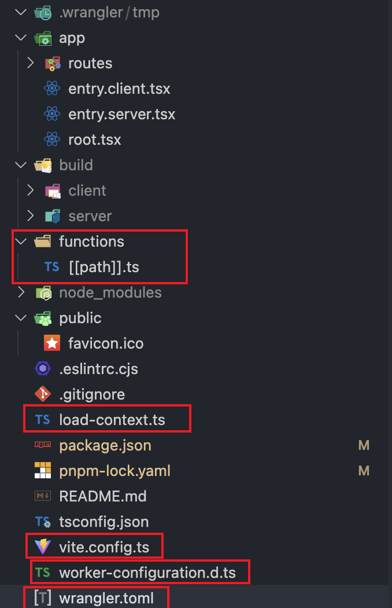

# 将remix项目迁移到cloudflare


# 将remix项目迁移到cloudflare

最近使用`remix`开发了一个项目,之前没有做过全栈开发,`reactjs`用过一些,不是很熟,用的是`Nextjs`, 感觉太难用, 主要是`13`版本换了`app router`后,有点摸不着头脑了.

后来发现`remix`这个, 直接用文件名路由,要方便许多, `loader`, `action` 的方式也非常直观, 于是就选用了`remix`

项目开发得差不多了,就想怎么部署,之前准备`Vercel`, 有一天看到 `https://blog.meathill.com/infra/vercel-vs-cloudflare-pages-how-to-choose-to-deploy-your-website.html`, 还是觉得`cloudflare`猛啊(适合白嫖)

于是准备迁移到`cloudflare`

## 步骤

`remix`是支持直接创建`cloudflare`部署的项目的,但是我已经是开发中的项目了,就不能用模板创建了.

### 复制文件

先用`remix`创建一个`cloudflare`模板项目: `pnpm create cloudflare@latest my-remix-app -- --framework=remix`

创建完成后, 和我自己的项目比较一下:

多出了这些文件,拷贝过去

### 安装库

```
pnpm add -d vite @cloudflare/workers-types autoprefixer postcss vite-tsconfig-paths wrangler
pnpm add @remix-run/cloudflare @remix-run/cloudflare-pages
```

### 文件修改

#### 在`tsconfig.json`中添加:

```JSON
"compilerOptions": {
    "lib": ["DOM", "DOM.Iterable", "ES2022"],
    "types": [
      "@remix-run/cloudflare",
      "vite/client",
      "@cloudflare/workers-types/2023-07-01"
  ],
```

#### wrangler.toml

按需配置`wrangler.toml`, 用到那些就配置那些, 我用到了`d1_database`, `r2_buckets` 等

#### postcss.config.cjs[js]

```javascript
module.exports = {
    plugins: {
      tailwindcss: {},
      autoprefixer: {},
    },
  };
```

#### tailwind.css

```css
@tailwind base;
@tailwind components;
@tailwind utilities;

export default {}
```

#### entry.server.tsx

```tsx
import type { AppLoadContext, EntryContext } from "@remix-run/cloudflare";
import { RemixServer } from "@remix-run/react";
import { isbot } from "isbot";
import { renderToReadableStream } from "react-dom/server";

export default async function handleRequest(
  request: Request,
  responseStatusCode: number,
  responseHeaders: Headers,
  remixContext: EntryContext,
  // This is ignored so we can keep it in the template for visibility.  Feel
  // free to delete this parameter in your app if you're not using it!
  // eslint-disable-next-line @typescript-eslint/no-unused-vars
  loadContext: AppLoadContext
) {
  const body = await renderToReadableStream(
    <RemixServer context={remixContext} url={request.url} />,
    {
      signal: request.signal,
      onError(error: unknown) {
        // Log streaming rendering errors from inside the shell
        console.error(error);
        responseStatusCode = 500;
      },
    }
  );

  if (isbot(request.headers.get("user-agent") || "")) {
    await body.allReady;
  }

  responseHeaders.set("Content-Type", "text/html");
  return new Response(body, {
    headers: responseHeaders,
    status: responseStatusCode,
  });
}
```

#### root.tsx

```tsx
import { cssBundleHref } from '@remix-run/css-bundle';
import type { LinksFunction } from '@remix-run/node';
import {
  Links,
  LiveReload,
  Meta,
  Outlet,
  Scripts,
  ScrollRestoration,
} from '@remix-run/react';

import styles from './tailwind.css?url';
import { ThemeProvider } from './context/themeContext';

// export const links: LinksFunction = () => [{ rel: 'stylesheet', href: './tailwind.css' }];
export const links = () => {
  return [
    { rel: "stylesheet", href: styles }
  ];
}

export default function App() {
  return (
    <ThemeProvider>
      <html lang="en">
        <head>
          <meta charSet="utf-8" />
          <meta name="viewport" content="width=device-width, initial-scale=1" />
          <Meta />
          <Links />
        </head>
        <body> 
            <Outlet />
            <ScrollRestoration />
            <Scripts />
            <LiveReload />
        </body>
      </html>
    </ThemeProvider>
  );
}
```

注意这个: `import styles from './tailwind.css?url';`, 多了个`?url`

#### package.json

```JSON
"scripts": {
    "build": "remix vite:build",
    "deploy": "pnpm run build && wrangler pages deploy ./build/client",
    "dev": "remix vite:dev",
    "lint": "eslint --ignore-path .gitignore --cache --cache-location ./node_modules/.cache/eslint .",
    "start": "wrangler pages dev ./build/client",
    "typecheck": "tsc",
    "typegen": "wrangler types",
    "preview": "pnpm run build && wrangler pages dev ./build/client",
    "build-cf-types": "wrangler types"
  },
```

### Node compatibility

根据官方, `nodejs`的一些核心库是不能直接在`worker` `pages`中运行的, 有两种方法, 第一种: `Use runtime APIs directly`, 我没有使用成功, 我使用的是第二种, `Add polyfills using Wrangler`, 在`wrangler.toml`中增加: `node_compat = true`, 注意两种不能兼容. 

### prisma 迁移

数据库之前是`PostgresSQL`,现在要迁移到`D1 Database`, 常见`Prisma`文档: `https://www.prisma.io/docs/orm/prisma-client/deployment/edge/deploy-to-cloudflare`

假设数据库名称为 `my-d1`, 先要生成`sql`
` pnpm npx wrangler d1 migrations create my-d1 --local`
会在本地生成migration目录, 在执行: 
```
pnpm npx prisma migrate diff \
  --from-empty \
  --to-schema-datamodel ./prisma/schema.prisma \
  --script \
  >> migrations/0001_init_.sql
```
第一次生成迁移文件, 会存放到`migrations/0001_init_.sql`中去. 
执行迁移文件: `pnpm npx wrangler d1 migrations apply my-d1 --local`
到这一步,迁移就完成了,但是,不出意外的出意外了: 
```
near "CONSTRAINT": syntax error at offset 41 [code: 7500]
```
这玩意也没有说是哪一行代码, 提示的`41`根本就不是, 只能一行行删除后实验, 最后发现是: `ALTER TABLE "tablename" ADD CONSTRAINT`
的错误, 差了一下:`https://developers.cloudflare.com/d1/reference/migrations/#foreign-key-constraints`

### bindings 使用

在`cloudflare pages`中使用`bindings`, 比如: `KV`, `R2`时,老是读取不到这些binding, 仔细研究测试多次,发现一些流程:

#### `functions/[[path]].ts` 

```typescript
export const onRequest = createPagesFunctionHandler({
	build,
	mode: process.env.NODE_ENV,
	getLoadContext: context => ({ env: context.context.cloudflare.env }),
});
```
getLoadContext要设置`env: context.context.cloudflare.env`

#### wrangler.toml

在文件中需要配置对应`binding`的信息, 并且, 在`cloudflare pages` 的`dashboard`里,也要配置对应环境(`production`, `preview`)的`binding`, 名称要一样


#### typegen

修改`wrangler.toml`或者`dashboard`中的`bindings`后, 需要运行: `pnpm run types`, 也就是: `wrangler types`, 会生成`worker-configuration.d.ts` 文件, `wrangler.toml`中对应的设置就会更新:

```typescript
interface Env {
	SOME_KV: KVNamespace;
	SOME_R2: R2Bucket;
}
```

#### 在`remix`服务端使用:

```typescript
context.env.SOME_KV.put(key, 'some value');
```


