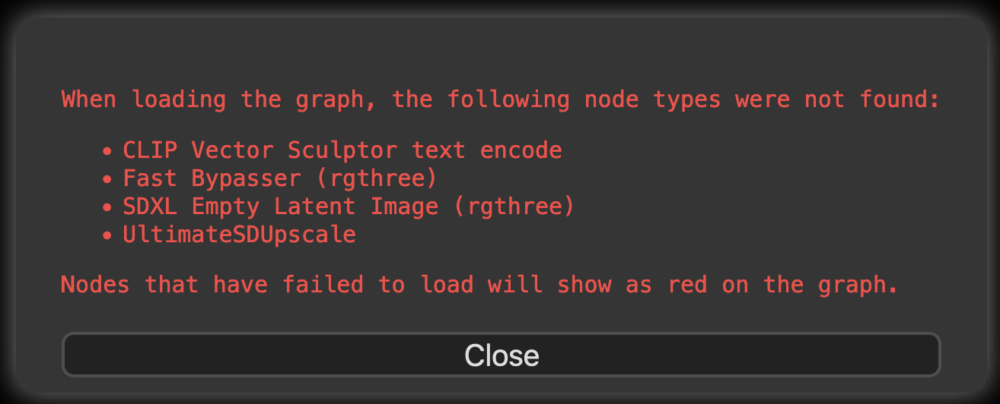

# 部署ComfyUI玩


# 部署ComfyUI玩

之前`AIGC`非常火, 我本地部署了`Stable Diffusion` 的`WebUI`玩了一下,见: [text](/content/posts/create-local-stable-diffusion-env.md)

但是吧, `WebUI` 界面, 太复杂了, 元素太多了, 看起来非常专业, 但是用起来也是有一定难度的. 正好那段时间工作比较忙, 玩了一段时间, 就放着没有继续玩了. 

最近, 又发现一个特别好用的`Stable Diffusion` 的`UI`, 叫做`ComfyUI`, 看起来非常舒服, 使用的是 节点链接:

可以看到, 不同的节点可以根据输入输出来链接, 每个节点有自己的功能, 非常直观, 擦了一下, 这个类型的`UI`叫: **可视化工作流 **

## 安装

`ComfyUI` 安装也很方便, 参照官网就可以了: `https://github.com/comfyanonymous/ComfyUI?tab=readme-ov-file#installing`.

注意
- `Nvidia`卡需要先安装`pytorch`:
`pip install torch torchvision torchaudio --extra-index-url https://download.pytorch.org/whl/cu121`
- `Apple Silicon` 也及时`M1/2/3`也是可以运行的, 这就是我为什么搞了`64G`统一内存的`MacbookPro`的原因: [详见帖子](/content/posts/macbookpro-16-m1max-64g-refurbish-buying-log/index.zh-cn.md). 需要安装`pytorh`的`nightly` 版本, 将: `https://github.com/comfyanonymous/ComfyUI?tab=readme-ov-file#apple-mac-silicon`

然后再安装`ComfyUI-Manager`:
 直接用`ComfyUI Manger`, 地址: `https://github.com/ltdrdata/ComfyUI-Manager`, `ComfyUI-Manger`是一个插件,可以方便管理各种开源的附加类型`节点`, 有了这个, `ComfyUI`的可玩性才更高. 注意, 需要放在`ComfyUI`的`custom_nodes`目录下, 所以需要先安装`ComfyUI`:

```bash
cd ComfyUI/custom_nodes
git clone https://github.com/ltdrdata/ComfyUI-Manager.git
```

### `python` 环境配置

最好使用`conda`来做, 安装`conda`后, 创建一个`python`环境:
```bash
conda create -n py310sd python=3.10 pytorch torchvision torchaudio cudatoolkit=11.3 -c pytorch -c nvidia
conda activate py310sd
```

### 模型配置

之前使用`WebUI`下载了的模型,就不用再次下载了,可以直接使用, 方法将文档:`https://github.com/comfyanonymous/ComfyUI?tab=readme-ov-file#how-do-i-share-models-between-another-ui-and-comfyui`, 简单说就是修改`config.yaml`:

```yaml
a111:
    base_path: path/to/stable-diffusion-webui/
```
指定`WebUI`的路径, 然后, 就可以使用`WebUI`下载的模型了.

## 使用

`python main.py --listen 0.0.0.0`

注意`--listen 0.0.0.0` 可以让你在非本机也可以访问, 比如我在`MacbookPro`上启动, 在`iPad`上也可以访问.

访问: `http://yourip:8188`, 然后, 打开新世界!!!


## 更多玩法

`ComfyUI`社区发展非常快, 各种`Node`层出不穷, 个人感觉已经超过`WebUI`的流行程度了. 最近又发现了一个好玩的: `https://comfyworkflows.com/`. 是一个`ComfyUI`的`Workflow`的聚集地, 有很多`Workflow`可以直接使用, 也可以自己创建, 然后分享给大家. 有了这个, 就可以直接使用别人的`Workflow`了, 不用自己创建了, 也可以学习别人的`Workflow`是怎么创建的.

比如, 我现在用这个: `https://comfyworkflows.com/workflows/e6c1c436-f878-4cc3-be0a-43ee96864467`

下载后, 在`ComfyUI`中选择`Upload`, 选择刚才下载的`json`文件, 然后就可以导入了. 我这里会报错: 

这个时候就体现`ComfyUI-Manager`的好处了, 点击'Manger': 
选择`Install Custom Nodes`: 
然后在搜索中选择需要的节点, 比如`UltimateSDUpscale`, 搜索出来后安装就可以了. 

最后加载的效果:


## 总结

`ComfyUI`这种形式,确实比以前的`WebUI`要方便很多, 可玩性极高, 我也是刚开始搞, 最近工作比较慢, 空了慢慢搞, `AIGC`这一关发展速度太快了, 感觉一天一个变, 希望不要掉队了哈...


