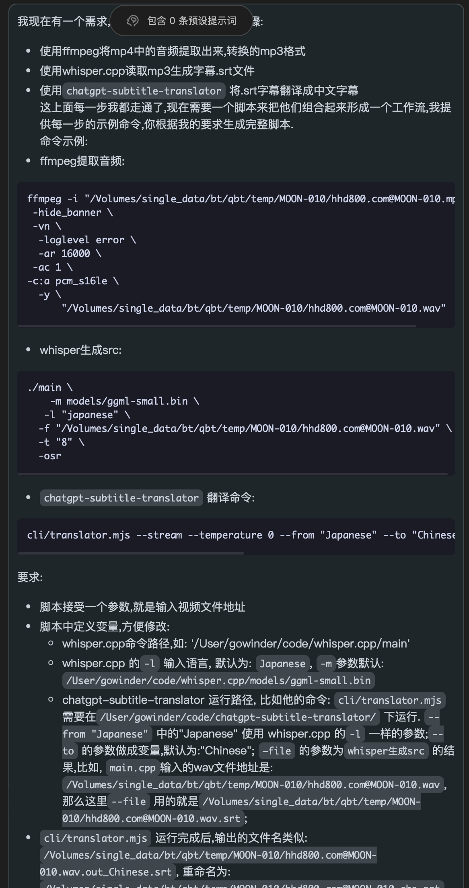

# 使用chatgpt帮我编写一个给视频文件生成中文字幕的脚本


# 使用chatgpt帮我编写一个给视频文件生成中文字幕的脚本

## 背景

因为有些冷门的电影或者视频，很难找到中文字幕，但是又有故事情节，这时候就需要自己手动添加中文字幕。但是手动添加中文字幕非常耗时，尤其是对于长视频来说。所以我想要使用chatgpt来帮我编写一个脚本，能够自动给视频文件生成中文字幕。

## 实现思路

首先要把流程分解成几个步骤：

- 使用`ffmpeg`提取视频的音频文件
- 使用`whisper.cpp`将音频文件转换成文本文件
- 使用`chatgpt-subtitle-translator`将文本文件翻译成中文字幕

每个步骤的命令大概如下:

### `ffmpeg`提取音频

`ffmpeg -i input.mp4 -hide_banner -vn -loglevel error -ar 16000 -ac 1 -c:a pcm_s16le -y output.wav -progress -`

### `whisper.cpp` 提取文本

`whisper.cpp`也可以翻译,但是只能到英文,如果用他翻译的英文再去翻译出中文,效果会更差,所以这里只是用来提取文本(英文)。

`./main -m models/ggml-small.bin -l $WHISPER_LANGUAGE -f $AUDIO_FILE_PATH -t 8 -osrt`

这个命令直将`$AUDIO_FILE_PATH`的音频文件转换成文本文件，并且保存为`.srt`英文字幕。`$WHISPER_LANGUAGE`是指定语言，这里可以选择英文或者其他语言。`-t 8`是指定线程数，可以根据自己的电脑性能来调整。

### `chatgpt-subtitle-translator`翻译文本

本来准备自己写一个脚本来调用`openai`的API来翻译文本，但是发现已经有人写好了一个脚本，叫做`chatgpt-subtitle-translator`，可以直接使用。这个脚本的使用方法可以参考[**这里**](https://github.com/Cerlancism/chatgpt-subtitle-translator.git)。

## `chatgpt`聊天过程

**第一次提问:**



我把问题描述得非常清楚了,有哪些步骤,每一步是什么,我具体的要求, 第一步他给出的答案:

```shell
#!/bin/bash

# 定义变量
VIDEO_FILE_PATH=\$1
WHISPER_PATH="/User/gowinder/code/whisper.cpp/main"
WHISPER_LANGUAGE="Japanese"
WHISPER_MODEL="/User/gowinder/code/whisper.cpp/models/ggml-small.bin"
TRANSLATOR_PATH="/User/gowinder/code/chatgpt-subtitle-translator/"
TRANSLATOR_TO_LANGUAGE="Chinese"

# 提取音频并转换为wav格式
AUDIO_FILE_PATH="${VIDEO_FILE_PATH%.*}.wav"
ffmpeg -i "$VIDEO_FILE_PATH" -hide_banner -vn -loglevel error -ar 16000 -ac 1 -c:a pcm_s16le -y "$AUDIO_FILE_PATH"

# 使用whisper生成srt字幕文件
SRT_FILE_PATH="${AUDIO_FILE_PATH%.*}.srt"
$WHISPER_PATH -m $WHISPER_MODEL -l $WHISPER_LANGUAGE -f "$AUDIO_FILE_PATH" -t "8" -osr

# 使用ChatGPT翻译字幕
TRANSLATED_SRT_FILE_PATH="${AUDIO_FILE_PATH%.*}.out_${TRANSLATOR_TO_LANGUAGE}.srt"
cd $TRANSLATOR_PATH
cli/translator.mjs --stream --temperature 0 --from "$WHISPER_LANGUAGE" --to "$TRANSLATOR_TO_LANGUAGE" --file "$SRT_FILE_PATH"

# 重命名输出文件
FINAL_SRT_FILE_PATH="${AUDIO_FILE_PATH%.*}.chs.srt"
mv "$TRANSLATED_SRT_FILE_PATH" "$FINAL_SRT_FILE_PATH"

```

这时可见回复基本已经把我需要的编辑好了,但是还有几个问题,如: 没有检查每一步的返回结果等,于是我继续提问:

**第二次提问:**

```
需要修改:
- 检测每一步时候正常完成,如果没有就退出
- `使用ChatGPT翻译字幕` 这一步不要`cd`到`TRANSLATOR_PATH` 目录去,而是设置他的工作目录
```

回答:

```
#!/bin/bash

# 定义变量
VIDEO_FILE_PATH=\$1
WHISPER_PATH="/User/gowinder/code/whisper.cpp/main"
WHISPER_LANGUAGE="Japanese"
WHISPER_MODEL="/User/gowinder/code/whisper.cpp/models/ggml-small.bin"
TRANSLATOR_PATH="/User/gowinder/code/chatgpt-subtitle-translator/"
TRANSLATOR_TO_LANGUAGE="Chinese"

# 提取音频并转换为wav格式
AUDIO_FILE_PATH="${VIDEO_FILE_PATH%.*}.wav"
ffmpeg -i "$VIDEO_FILE_PATH" -hide_banner -vn -loglevel error -ar 16000 -ac 1 -c:a pcm_s16le -y "$AUDIO_FILE_PATH"
if [ $? -ne 0 ]; then
    echo "Error: Failed to extract audio from video."
    exit 1
fi

# 使用whisper生成srt字幕文件
SRT_FILE_PATH="${AUDIO_FILE_PATH%.*}.srt"
$WHISPER_PATH -m $WHISPER_MODEL -l $WHISPER_LANGUAGE -f "$AUDIO_FILE_PATH" -t "8" -osr
if [ $? -ne 0 ]; then
    echo "Error: Failed to generate srt file."
    exit 1
fi

# 使用ChatGPT翻译字幕
TRANSLATED_SRT_FILE_PATH="${AUDIO_FILE_PATH%.*}.out_${TRANSLATOR_TO_LANGUAGE}.srt"
pushd $TRANSLATOR_PATH
cli/translator.mjs --stream --temperature 0 --from "$WHISPER_LANGUAGE" --to "$TRANSLATOR_TO_LANGUAGE" --file "$SRT_FILE_PATH"
popd
if [ $? -ne 0 ]; then
    echo "Error: Failed to translate srt file."
    exit 1
fi

# 重命名输出文件
FINAL_SRT_FILE_PATH="${AUDIO_FILE_PATH%.*}.chs.srt"
mv "$TRANSLATED_SRT_FILE_PATH" "$FINAL_SRT_FILE_PATH"
if [ $? -ne 0 ]; then
    echo "Error: Failed to rename srt file."
    exit 1
fi

echo "Subtitle generation completed successfully."
```

我想把一些配置放到`.env`文件中去,于是

**第三次提问:**

```
将 :

WHISPER_PATH="/User/gowinder/code/whisper.cpp/main"
WHISPER_LANGUAGE="Japanese"
WHISPER_MODEL="/User/gowinder/code/whisper.cpp/models/ggml-small.bin"
TRANSLATOR_PATH="/User/gowinder/code/chatgpt-subtitle-translator/"
TRANSLATOR_TO_LANGUAGE="Chinese"

放到env文件中去
```

输出结果:

```shell
#!/bin/bash

# 读取环境变量
source .env

# 输入的视频文件路径
VIDEO_FILE_PATH=\$1

# 提取音频并转换为wav格式
AUDIO_FILE_PATH="${VIDEO_FILE_PATH%.*}.wav"
ffmpeg -i "$VIDEO_FILE_PATH" -hide_banner -vn -loglevel error -ar 16000 -ac 1 -c:a pcm_s16le -y "$AUDIO_FILE_PATH"
if [ $? -ne 0 ]; then
    echo "Error: Failed to extract audio from video."
    exit 1
fi

# 使用whisper生成srt字幕文件
SRT_FILE_PATH="${AUDIO_FILE_PATH%.*}.srt"
$WHISPER_PATH -m $WHISPER_MODEL -l $WHISPER_LANGUAGE -f "$AUDIO_FILE_PATH" -t "8" -osr
if [ $? -ne 0 ]; then
    echo "Error: Failed to generate srt file."
    exit 1
fi

# 使用ChatGPT翻译字幕
TRANSLATED_SRT_FILE_PATH="${AUDIO_FILE_PATH%.*}.out_${TRANSLATOR_TO_LANGUAGE}.srt"
pushd $TRANSLATOR_PATH
cli/translator.mjs --stream --temperature 0 --from "$WHISPER_LANGUAGE" --to "$TRANSLATOR_TO_LANGUAGE" --file "$SRT_FILE_PATH"
popd
if [ $? -ne 0 ]; then
    echo "Error: Failed to translate srt file."
    exit 1
fi

# 重命名输出文件
FINAL_SRT_FILE_PATH="${AUDIO_FILE_PATH%.*}.chs.srt"
mv "$TRANSLATED_SRT_FILE_PATH" "$FINAL_SRT_FILE_PATH"
if [ $? -ne 0 ]; then
    echo "Error: Failed to rename srt file."
    exit 1
fi

echo "Subtitle generation completed successfully."
```

然后我需要一些日志之类的,还有删除中间文件的操作,增加跳过的步骤等...
最终结果:

```
#!/bin/bash

# 读取环境变量
source .env

# 输入的视频文件路径
VIDEO_FILE_PATH=\$1

# 跳过的步骤数
SKIP_STEP=\$2

# 提取音频并转换为wav格式
AUDIO_FILE_PATH="${VIDEO_FILE_PATH%.*}.wav"
if [ "$SKIP_STEP" -lt 1 ]; then
    echo "Starting audio extraction: ffmpeg -i $VIDEO_FILE_PATH -hide_banner -vn -loglevel error -ar 16000 -ac 1 -c:a pcm_s16le -y $AUDIO_FILE_PATH"
    START=$(date +%s)
    ffmpeg -i "$VIDEO_FILE_PATH" -hide_banner -vn -ar 16000 -ac 1 -c:a pcm_s16le -y "$AUDIO_FILE_PATH" -progress -
    if [ $? -ne 0 ]; then
        echo "Error: Failed to extract audio from video."
        exit 1
    fi
    END=$(date +%s)
    DIFF=$(($END - $START))
    echo "Audio extraction completed in $DIFF seconds."
else
    echo "Skipping audio extraction step."
fi

# 使用whisper生成srt字幕文件
SRT_FILE_PATH="${AUDIO_FILE_PATH%.*}.wav.srt"
if [ "$SKIP_STEP" -lt 2 ]; then
    echo "Starting srt generation: $WHISPER_PATH -m $WHISPER_MODEL -l $WHISPER_LANGUAGE -f $AUDIO_FILE_PATH -t 8 -osr"
    START=$(date +%s)
    $WHISPER_PATH -m $WHISPER_MODEL -l $WHISPER_LANGUAGE -f "$AUDIO_FILE_PATH" -t "8" -osrt
    if [ $? -ne 0 ]; then
        echo "Error: Failed to generate srt file."
        exit 1
    fi
    END=$(date +%s)
    DIFF=$(($END - $START))
    echo "Srt generation completed in $DIFF seconds."
else
    echo "Skipping srt generation step."
fi

# 重命名whisper生成的srt文件
RENAME_SRT_FILE_PATH="${AUDIO_FILE_PATH%.*}.srt"
if [ "$SKIP_STEP" -lt 3 ]; then
    echo "Starting srt file renaming: mv $SRT_FILE_PATH $RENAME_SRT_FILE_PATH"
    START=$(date +%s)
    mv "$SRT_FILE_PATH" "$RENAME_SRT_FILE_PATH"
    if [ $? -ne 0 ]; then
        echo "Error: Failed to rename srt file."
        exit 1
    fi
    END=$(date +%s)
    DIFF=$(($END - $START))
    echo "Srt file renaming completed in $DIFF seconds."
else
    echo "Skipping srt file renaming step."
fi

# 使用ChatGPT翻译字幕
TRANSLATED_SRT_FILE_PATH="${AUDIO_FILE_PATH%.*}.out_${TRANSLATOR_TO_LANGUAGE}.srt"
if [ "$SKIP_STEP" -lt 4 ]; then
    echo "Starting srt translation: cli/translator.mjs --stream --temperature 0 --from $WHISPER_LANGUAGE --to $TRANSLATOR_TO_LANGUAGE --file $RENAME_SRT_FILE_PATH"
    START=$(date +%s)
    pushd $TRANSLATOR_PATH
    cli/translator.mjs --stream --temperature 0 --from "$WHISPER_LANGUAGE" --to "$TRANSLATOR_TO_LANGUAGE" --file "$RENAME_SRT_FILE_PATH"
    popd
    if [ $? -ne 0 ]; then
        echo "Error: Failed to translate srt file."
        exit 1
    fi
    END=$(date +%s)
    DIFF=$(($END - $START))
    echo "Srt translation completed in $DIFF seconds."
else
    echo "Skipping srt translation step."
fi

# 重命名输出文件
FINAL_SRT_FILE_PATH="${AUDIO_FILE_PATH%.*}.chs.srt"
if [ "$SKIP_STEP" -lt 5 ]; then
    echo "Starting final file renaming: mv $TRANSLATED_SRT_FILE_PATH $FINAL_SRT_FILE_PATH"
    START=$(date +%s)
    mv "$TRANSLATED_SRT_FILE_PATH" "$FINAL_SRT_FILE_PATH"
    if [ $? -ne 0 ]; then
        echo "Error: Failed to rename final srt file."
        exit 1
    fi
    END=$(date +%s)
    DIFF=$(($END - $START))
    echo "Final file renaming completed in $DIFF seconds."
else
    echo "Skipping final file renaming step."
fi

# 删除wav文件
if [ "$SKIP_STEP" -lt 6 ]; then
    echo "Deleting wav file: rm $AUDIO_FILE_PATH"
    rm "$AUDIO_FILE_PATH"
    if [ $? -ne 0 ]; then
        echo "Error: Failed to delete wav file."
        exit 1
    fi
else
    echo "Skipping wav file deletion step."
fi

echo "Subtitle generation completed successfully."
```

## 效果

最后在`macbook m1 max 64g`上测试的效果, 一个`1:38:50`的`mp4`,最后:

```
Total time: 622 seconds.
Total tokens: 72580
Total cost: 0.145 USD
Total number of subtitles: 198
```

差不多用了10分钟,(因为我的mp4文件是`nfs`挂载的,读取和写入`wav`都是通过网路,这块就花了`75`秒,`whisper.cpp` 花费了`172`秒, 差不多3分钟, 其他的时间就是调用`openai`翻译的时间了),其实还是很快的.

视频截图:


## 总结
最后这个脚本就非常好用了.

总结上面的,我个人会`linux`命令,但是对`shell script`不是很熟悉,而且不想写,因为调试不方便,用`chatgpt`非常方便,我个人觉得`gpt-4`已经很准确了,前提是需求一定要提明确,修改过程中需要偶尔再次提示一下上下文,不然他会忘记.

